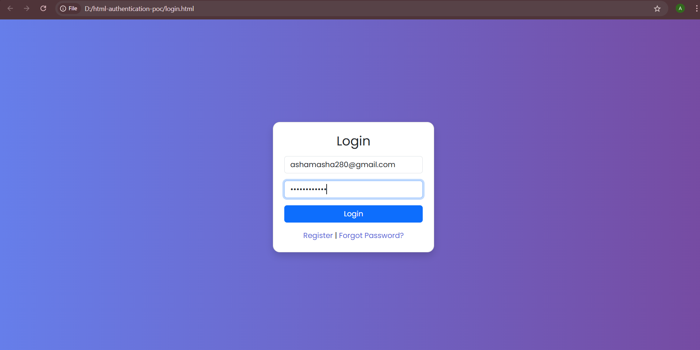
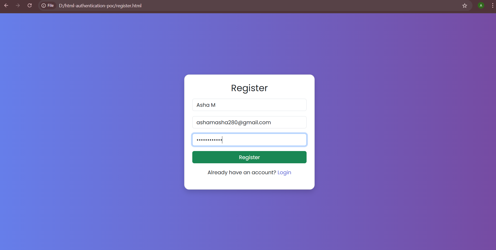
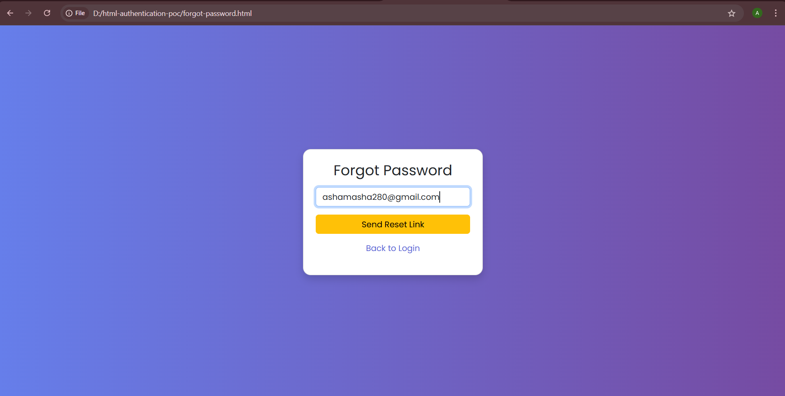
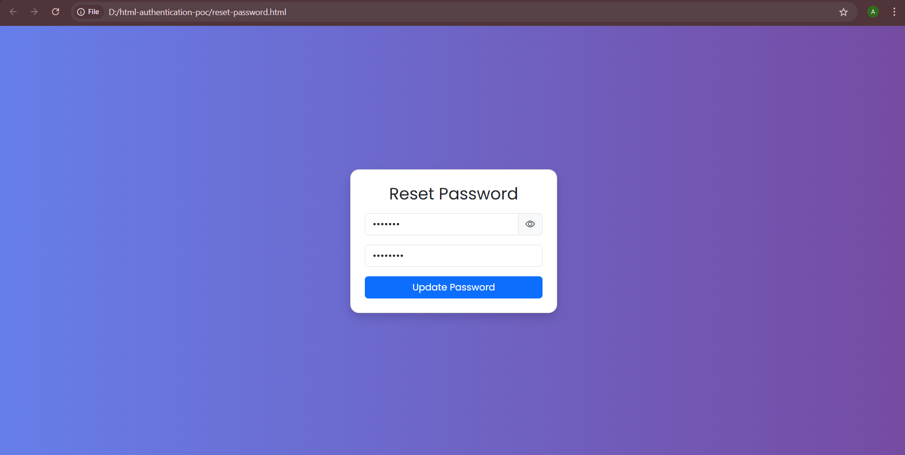
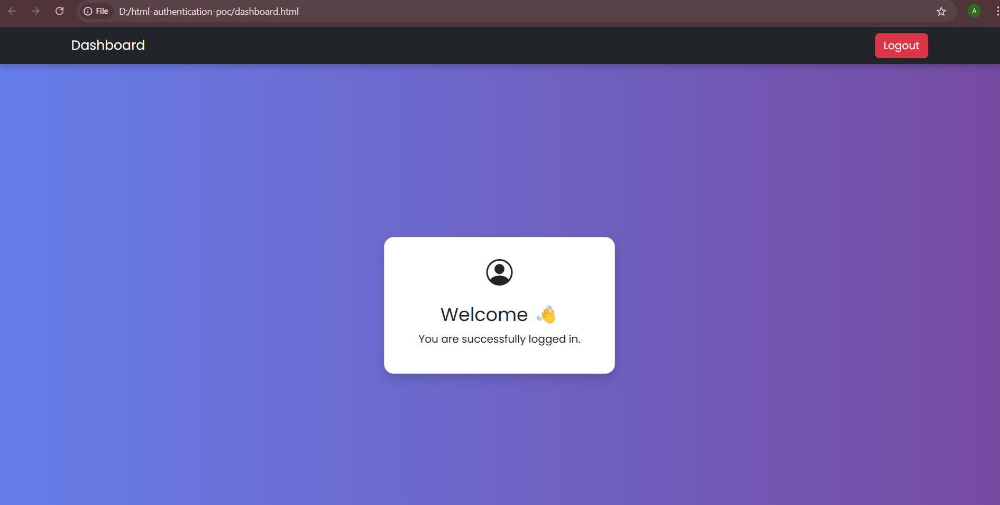

# Authentication System UI (Bootstrap 5)

## 📌 Description
This project is a responsive authentication system built using HTML, Bootstrap 5, and custom CSS.

## 🚀 Features
- Login Page
- Registration Page
- Forgot Password
- Reset Password
- Dashboard
- Responsive Design

## 🛠 Technologies Used
- HTML5
- Bootstrap 5
- CSS3

## 📂 Project Structure
- index.html
- register.html
- forgot-password.html
- reset-password.html
- dashboard.html
- styles.css

## ▶️ How to Run
Open index.html in any browser
## 📸 Screenshots

### 🔐 Login Page

### 📝 Register Page

### 🔑 Forgot Password

### 🔄 Reset Password

### 📊 Dashboard
